# Car Traffic Nowcasting in Medellin City
Each year Medellin drivers spend 138 hours stuck in traffic jams, which places the city as the 7° city in Latin America with the worst traffic, and number 25 among 220 cities in the world [1].<br>
Many areas of transportation lack data, and decision-makers arround the world often plan infrastructure and policy based on uncertain information. In recent years, new types of sensors have become available, and ML can provide relevant information from these data, although the Medellin has this type of sensors, its analysis is currently carried out largely by humans, which significantly limits the amount of information available for decision making.

The goal of this project is to generate an open and high-quality API capable of estimating traffic at key points of the city, based on the information provided by traffic cameras, this in order to help and encourage the development of applications that cover the traffic problem in an intelligent way.

This project is part of the [ai colab](https://sites.google.com/view/aicolab/home) initiative

## Phase 1: Vehicle classification
The main goal of this phase is to develop a model capable of distinguishing whether a vehicle is a bus, car, motorcycle, taxi or a truck.

### Dataset
The images used for this phase were downloaded directly from the [Medellin's mobility ministry website](https://www.medellin.gov.co/simm/mapas/index.html?map=camarasCctv), as was mention before bus, car, motorcycle, taxi and truck were used as labels, here is a sample image for each class:
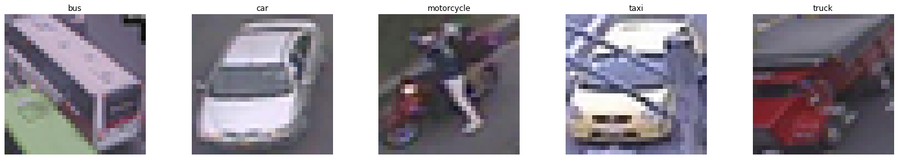


For this step there are 3649 image: 2570 for train, 549 for validation and 549 for test 
#### Data preprocessing 
The preprocessing used was quite simple, basically the images were resized so that they were square, additionally, they were standardized in such a way that their pixels were values between 0 and 1.
#### Data augmentation
**TODO**

---

### Architecture 1: linear model
 * Git Hash: [c465ec8](https://github.com/shpotes/image-classification/tree/c465ec817a07d5d88636352c2c5febfe345870fc)
 * Hyperparameters:  [config file](https://raw.githubusercontent.com/shpotes/image-classification/c465ec817a07d5d88636352c2c5febfe345870fc/config.json)

#### Overfiting a single batch.
The idea of this experiment is to validate that your whole pipeline works.

**Learning curves**: 
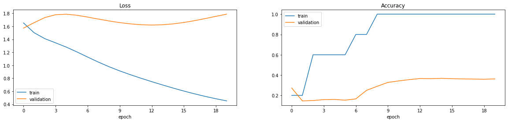
**Metric**: 
```
> train:    1/1 [==============================] - 0s 5ms/step - loss: 0.4220 - accuracy: 1.0000
> test: 106/106 [==============================] - 0s 3ms/step - loss: 1.7935 - accuracy: 0.3686
```

#### Train on the whole training set.
The idea of this experiment is to validate that your model has enough predictive power for your data. It is very likely that a linear model won’t get good enough training performance, do not worry too much about it. The idea is to quickly set up a baseline in performance.

**Learning curves**: 

**Metric**: 
```
> train:    1/1 [==============================] - 0s 5ms/step - loss: 0.4220 - accuracy: 1.0000
> test: 106/106 [==============================] - 0s 3ms/step - loss: 1.7935 - accuracy: 0.3686
```
**sample predictions**:
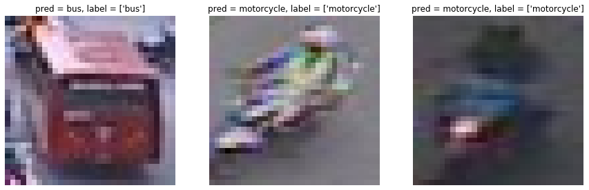

**confusion matrix**:<br>
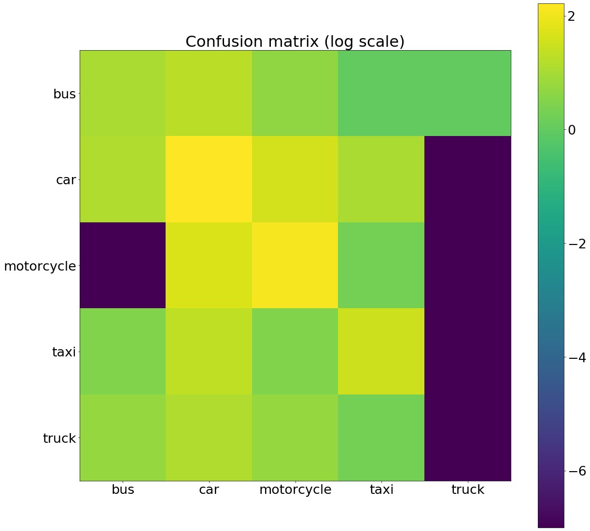

---

### Architecture 2: LeNet
Based on [2] practically the same model, but replacing the cost function by categorical cross-entropy

 * Git Hash: [840ab91](https://github.com/shpotes/image-classification/tree/840ab9197ca3cbd1ace4b7c6337f2616b2981775)
 * Hyperparameters: [config file](https://raw.githubusercontent.com/shpotes/image-classification/840ab9197ca3cbd1ace4b7c6337f2616b2981775/config.json)

#### Overfiting a single batch.
The idea of this experiment is to validate that your whole pipeline works.

**Learning curves**: 
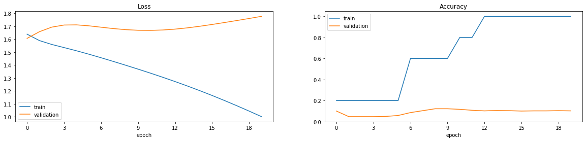
**Metric**: 
```
> train    1/1 [==============================] - 0s 6ms/step - loss: 0.9579 - accuracy: 1.0000
> test 106/106 [==============================] - 1s 5ms/step - loss: 1.7335 - accuracy: 0.1153
```

#### Train on the whole training set.
The idea of this experiment is to validate that your model has enough predictive power for your data. 

**Learning curves**: 
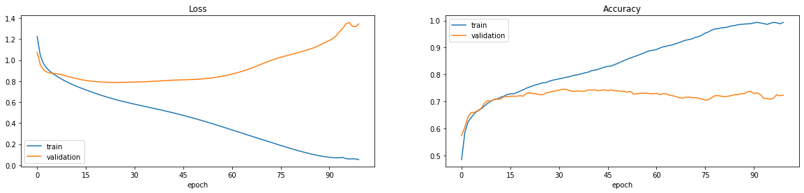
**Metric**: 
```
> train 161/161 [==============================] - 2s 11ms/step - loss: 0.1264 - accuracy: 0.9595
> test  161/161 [==============================] - 0s 13ms/step - loss: 1.4132 - accuracy: 0.7146
```
**sample predictions**:
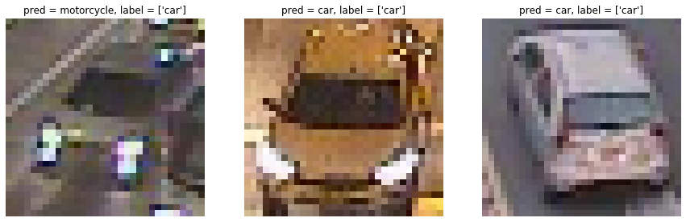


**confusion matrix**:<br>
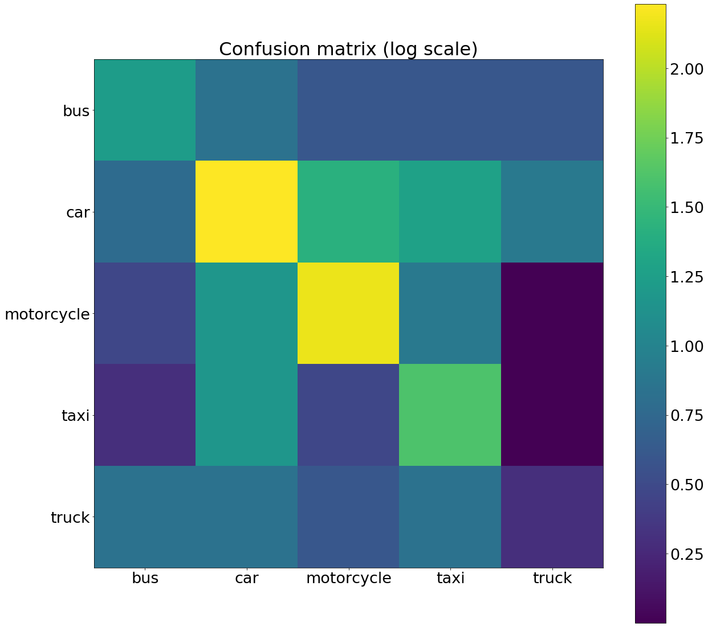

---

### Architecture 3: AlexNet
Exactly the model described at [3]
 * Git Hash: [b3e520c](https://github.com/shpotes/image-classification/tree/b3e520c7482183820c6a00a3b33973c98693b789)
 * Hyperparameters: [config file](https://raw.githubusercontent.com/shpotes/image-classification/b3e520c7482183820c6a00a3b33973c98693b789/config.json)

#### Overfiting a single batch.
The idea of this experiment is to validate that your whole pipeline works.

**Learning curves**: 
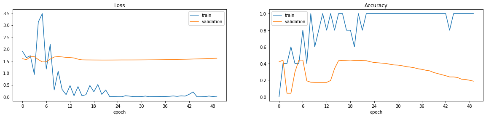
**Metric**: 
```
> train    1/1 [==============================] - 0s 17ms/step - loss: 1.6254 - accuracy: 0.2000
> test 106/106 [==============================] - 1s 10ms/step - loss: 1.6023 - accuracy: 0.1890
```

#### Train on the whole training set.
The idea of this experiment is to validate that your model has enough predictive power for your data.

**Learning curves**: 
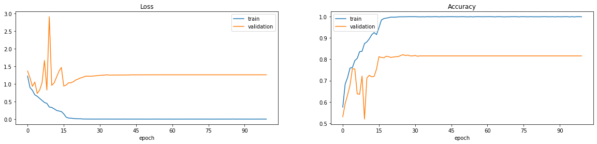
**Metric**: 
```
> train 161/161 [==============================] - 4s 23ms/step - loss: 0.0082 - accuracy: 0.9969
> test    34/34 [==============================] - 1s 27ms/step - loss: 1.1180 - accuracy: 0.8091
```
**sample predictions**:
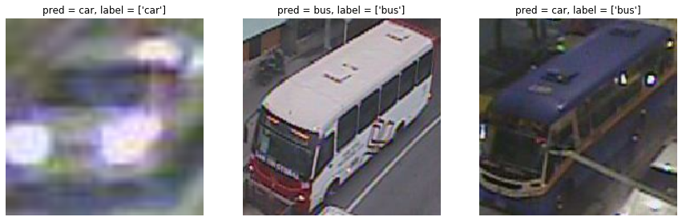


**confusion matrix**:<br>
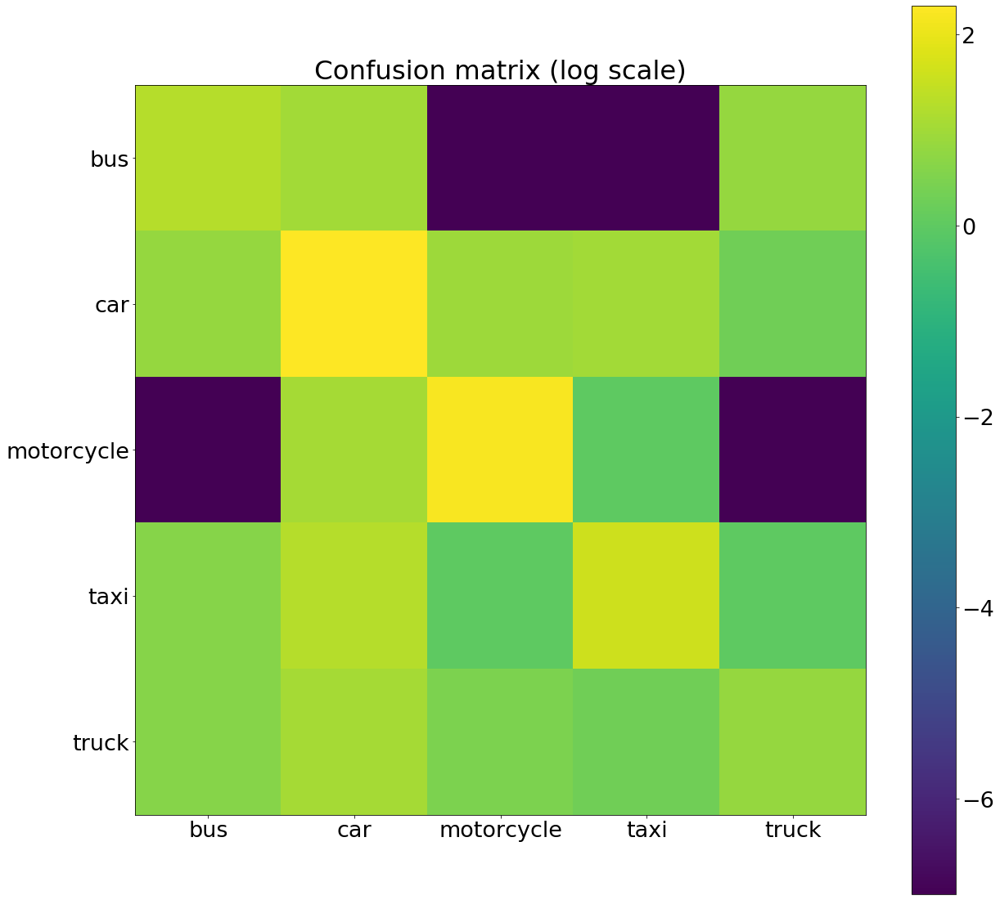

---

### Architecture 3: VGG
Exactly the model described at [4]
* Git Hash: [94f1ff1](https://github.com/shpotes/image-classification/tree/94f1ff189f41df8976d737a0a5e1d585772cf180)
* Hyperparameters: [config file](https://raw.githubusercontent.com/shpotes/image-classification/94f1ff189f41df8976d737a0a5e1d585772cf180/config.json)

#### Overfiting a single batch.
The idea of this experiment is to validate that your whole pipeline works.

**Learning curves**: 
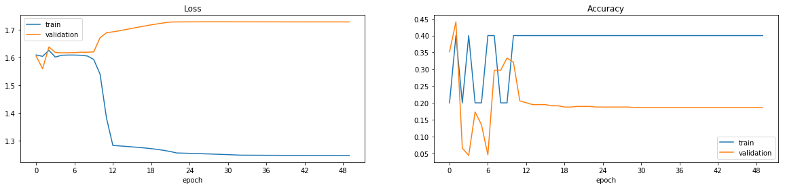
**Metric**: 
```
> train    1/1 [==============================] - 0s 66ms/step - loss: 1.7742 - accuracy: 0.2000
> test 106/106 [==============================] - 4s 41ms/step - loss: 1.7701 - accuracy: 0.1153
```

#### Train on the whole training set.
The idea of this experiment is to validate that your model has enough predictive power for your data. 

**Learning curves**: 
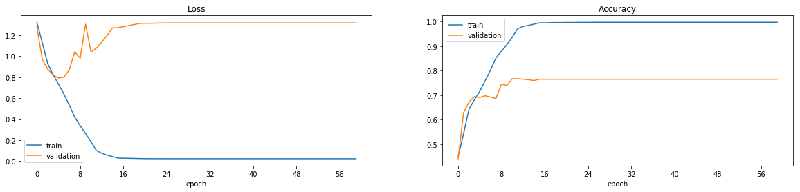
**Metric**: 
```
> train 215/215 [==============================] - 16s 74ms/step - loss: 0.0225 - accuracy: 0.9969
> test    45/45 [==============================] - 4s 90ms/step - loss: 1.3568 - accuracy: 0.7599
```
**sample predictions**:
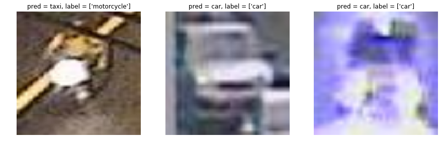


**confusion matrix**:<br>
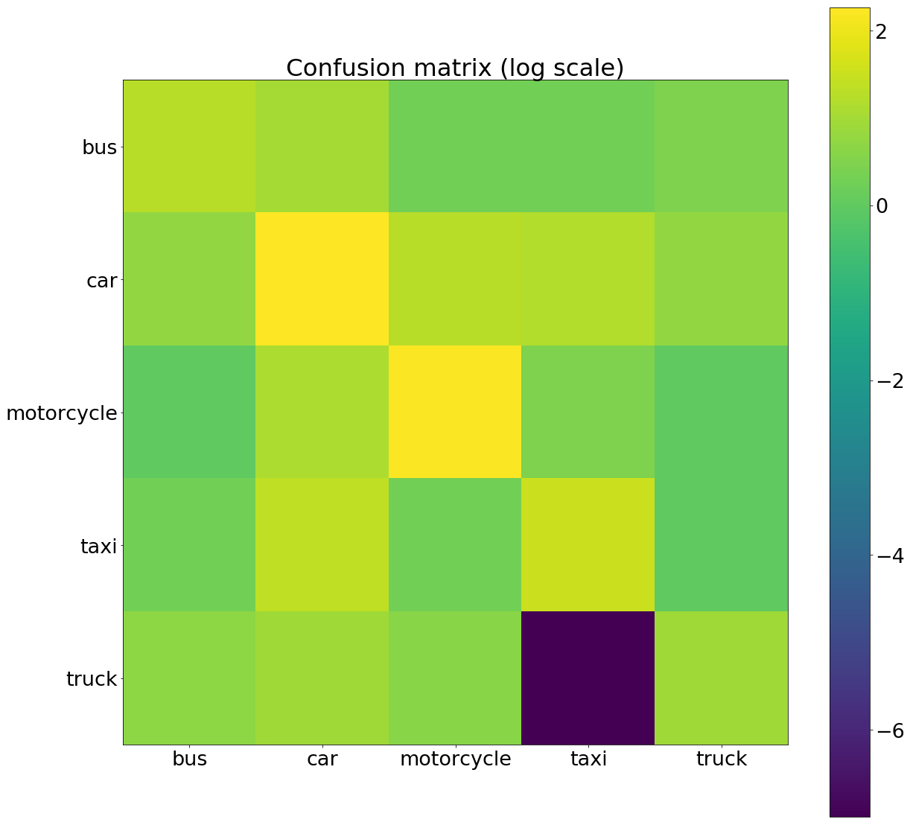

---

### Architecture 3: ResNet
For this experiment, the 18-layers version of ResNet [5] were used, but replacing the original shurtcut connection by the proposed at [6]
* Git Hash: [babb65a](https://github.com/shpotes/traffic-nowcasting-medellin-city/tree/babb65a9dc5cf6483d1824be867df9fab1d30577)
* Hyperparameters: [config file](https://raw.githubusercontent.com/shpotes/traffic-nowcasting-medellin-city/babb65a9dc5cf6483d1824be867df9fab1d30577/config.json)

#### Overfiting a single batch.
The idea of this experiment is to validate that your whole pipeline works.

**Learning curves**: 
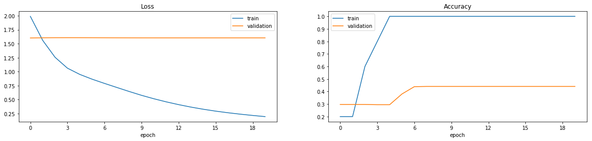
**Metric**: 
```
> train    1/1 [==============================] - 0s 28ms/step - loss: 1.6079 - accuracy: 0.2000
> test 106/106 [==============================] - 2s 18ms/step - loss: 1.6048 - accuracy: 0.4348
```

#### Train on the whole training set.
The idea of this experiment is to validate that your model has enough predictive power for your data. 

**Learning curves**: 

**Metric**: 
```
> train 215/215 [==============================] - 16s 75ms/step - loss: 0.0167 - accuracy: 0.9969
> test    45/45 [==============================] - 4s 91ms/step - loss: 1.5851 - accuracy: 0.7599
```
**sample predictions**:
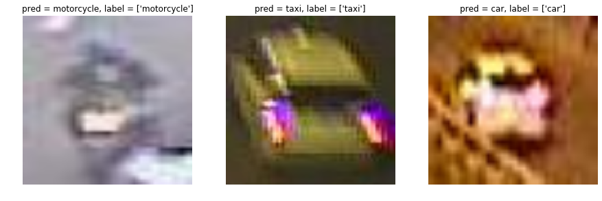


**confusion matrix**:<br>
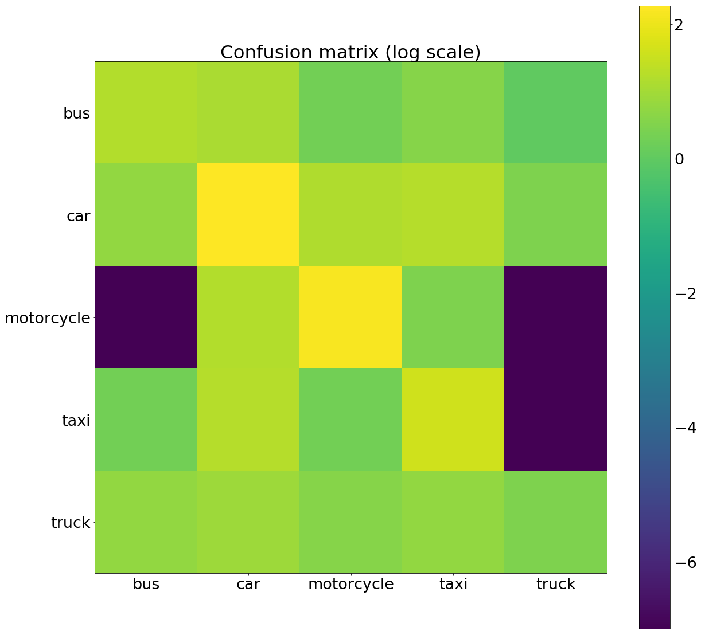

---

References 
--
[1] Inrix. (n.d.). INRIX Global Traffic Scorecard. Retrieved from http://inrix.com/scorecard/<br>
[2] Lecun, Y., Bottou, L., Bengio, Y., & Haffner, P. (1998). Gradient-based learning applied to document recognition. Proceedings of the IEEE, 86(11), 2278–2324. https://doi.org/10.1109/5.726791<br>
[3] Krizhevsky, A., Sutskever, I., & Hinton, G. E. (2017). ImageNet classification with deep convolutional neural networks. Communications of the ACM, 60(6), 84–90. https://doi.org/10.1145/3065386<br>
[4] Liu, S., & Deng, W. (2015). Very deep convolutional neural network based image classification using small training sample size. In 2015 3rd IAPR Asian Conference on Pattern Recognition (ACPR). IEEE. https://doi.org/10.1109/acpr.2015.7486599<br>
[5] He, K., Zhang, X., Ren, S., & Sun, J. (2016). Deep Residual Learning for Image Recognition. In 2016 IEEE Conference on Computer Vision and Pattern Recognition (CVPR). IEEE. https://doi.org/10.1109/cvpr.2016.90<br>
[6] He, K., Zhang, X., Ren, S., & Sun, J. (2016). Identity Mappings in Deep Residual Networks. In Computer Vision – ECCV 2016 (pp. 630–645). Springer International Publishing. https://doi.org/10.1007/978-3-319-46493-0_38 <br>
